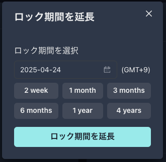

---
layout:
  title:
    visible: true
  description:
    visible: false
  tableOfContents:
    visible: true
  outline:
    visible: true
  pagination:
    visible: true
---

# Ethereumでのオークション

オークション成立後、

オークション主催者は、入札されたトークンを回収してください。

オークション参加者は、分配されたトークンを請求してください。

トークンの回収か請求のどちらか一方が済みますと、

ダッシュボードのユーザーリワードのエリアに請求可能額が表示されます（下の画像の10.000YMWK）

<figure><figcaption></figcaption></figure>

YMWKをウォレットに追加していない場合は、「YMWKをウォレットに追加」のボタンを押してください。

最下部の「請求」ボタンを押してください。

<figure><figcaption></figcaption></figure>

ガス代を確認の上、「確認」ボタンを押してください。

トランザクションが成功しましたら、ウォレットをご確認ください。

<figure><figcaption></figcaption></figure>

YMWKが届いていれば、完了です！おめでとうございます！🎉
