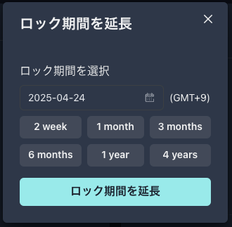

# Factoryユースケース

## [アクター](https://github.com/DeFiGeek-Community/yamawake/blob/main/doc/ja/Factory/usecase.md#%E3%82%A2%E3%82%AF%E3%82%BF%E3%83%BC) 

* ファクトリーオーナー
  * ファクトリーを立ち上げる
  * オークションテンプレートを追加する
  * オークションテンプレートを削除する
* ファクトリー
  * オークションテンプレートを保持する
  * オークションを立ち上げる
* オークション主催者
  * オークション立ち上げを申し込む

## ユースケース図

<figure><figcaption></figcaption></figure>
