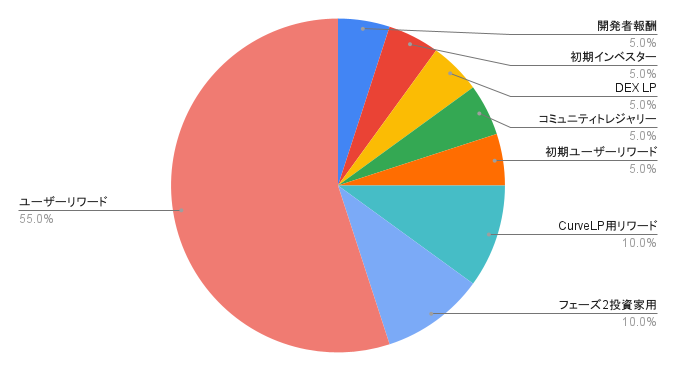

---
layout:
  title:
    visible: true
  description:
    visible: false
  tableOfContents:
    visible: true
  outline:
    visible: true
  pagination:
    visible: true
---

# YMWK（Yamawake DAO Token）

### <mark style="color:blue;">YMWKとは？</mark> 

Yamawake に付随するユーティリティトークン（ERC20）です。初期発行量450,000,000とし、1年目55,000,000、年次逓減10％で235年に渡って発行します。発行量は最終的に1,000,000,000に収束します。

ティッカー：YMWK

コントラクトアドレス：0x15Dac05C93e1c5F31a29547340997BA9f6ec4F87

DEXリンク：

### <mark style="color:blue;">アロケーション</mark>

<figure><figcaption></figcaption></figure>

<table><thead><tr><th width="224.33333333333331" align="center">割合(%)</th><th align="center">名目</th><th align="center">備考</th></tr></thead><tbody><tr><td align="center">5</td><td align="center">開発者報酬</td><td align="center"></td></tr><tr><td align="center">5</td><td align="center">初期インベスター</td><td align="center">TXJPホルダーへのエアドロップ</td></tr><tr><td align="center">5</td><td align="center">DEX LP</td><td align="center">Uniswap v3 YMWK-ETH Pool $0.1~$1</td></tr><tr><td align="center">5</td><td align="center">コミュニティトレジャリー</td><td align="center">defigeek.eth</td></tr><tr><td align="center">5</td><td align="center">初期ユーザーリワード</td><td align="center"></td></tr><tr><td align="center">10</td><td align="center">CurveLP用リワード</td><td align="center">年次2%ベスティング5年間</td></tr><tr><td align="center">10</td><td align="center">フェーズ2投資家用</td><td align="center">クリフ2年、3年目解放</td></tr><tr><td align="center">55</td><td align="center">ユーザーリワード</td><td align="center">初年度5.5% 年次10%逓減</td></tr></tbody></table>

## <mark style="color:blue;">veYMWKとは？</mark>

veYMWKとは、YMWKをロックすることで得られる転送不可のトークンです。

最長4年のロックで 1 YMWK ＝ 1 veYMWKです。

1年ロックの場合は 1 YMWK ＝ 0.25 veYMWKです。

時間の経過で減衰していきます。

ロック期間はいつでも最長4年まで延長できますが、短縮や解除をすることはできません。

### <mark style="color:blue;">veYMWKの用途</mark>

プロトコルfeeの獲得

YMWKリワードの獲得

その他拡張予定
