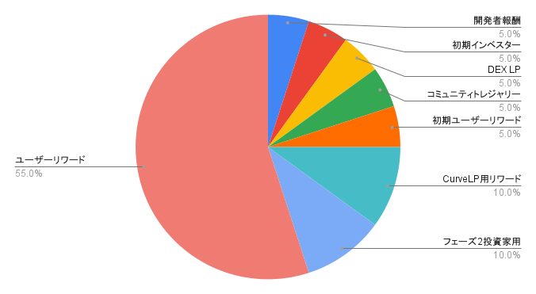

# YMWK(Yamawake DAO Token)

### <mark style="color:blue;">YMWKとは？</mark> 

Curve Dao TokenをベースにしたERC20トークン。初期発行量450,000,000とし、1年目55,000,000、年次逓減10％で235年に渡って発行する。発行量は最終的に1,000,000,000に収束する。

ティッカー：YMWK

コントラクトアドレス：

DEXリンク：

### <mark style="color:blue;">アロケーション</mark>

<figure><figcaption></figcaption></figure>

<table><thead><tr><th width="224.33333333333331" align="center">割合(%)</th><th align="center">名目</th><th align="center">備考</th></tr></thead><tbody><tr><td align="center">5</td><td align="center">開発者報酬</td><td align="center"></td></tr><tr><td align="center">5</td><td align="center">初期インベスター</td><td align="center">TXJPホルダーへのエアドロップ</td></tr><tr><td align="center">5</td><td align="center">DEX LP</td><td align="center">Uniswap v3 YMWK-ETH Pool $0.1~$1</td></tr><tr><td align="center">5</td><td align="center">コミュニティトレジャリー</td><td align="center">defigeek.eth</td></tr><tr><td align="center">5</td><td align="center">初期ユーザーリワード</td><td align="center"></td></tr><tr><td align="center">10</td><td align="center">CurveLP用リワード</td><td align="center">年次2%ベスティング5年間</td></tr><tr><td align="center">10</td><td align="center">フェーズ2投資家用</td><td align="center">クリフ2年、3年目解放</td></tr><tr><td align="center">55</td><td align="center">ユーザーリワード</td><td align="center">初年度5.5% 年次10%逓減</td></tr></tbody></table>

## <mark style="color:blue;">veYMWKとは？</mark>

veYMWKとはYMWKをロックすることで得られる転送不可のトークンです。

最長4年のロックで1YMWK＝1veYMWKです。

1年ロックの場合は1YMWK＝0.25veYMWKです。

時間の経過で減衰していきます。

ロック期間はいつでも最長4年まで延長できますが、短縮や解除をすることはできません。

### <mark style="color:blue;">veYMWKの用途</mark>

プロトコルfeeの獲得

YMWKリワードの獲得

その他拡張予定

### [登場するロール](https://github.com/DeFiGeek-Community/yamawake/blob/main/doc/ja/YamawakeToken/index.md#%E7%99%BB%E5%A0%B4%E3%81%99%E3%82%8B%E3%83%AD%E3%83%BC%E3%83%AB) 

* Minter: 予め設定された範囲内の発行数までを指定数Mintできる
* Admin: Minterを指定できる

### [機能](https://github.com/DeFiGeek-Community/yamawake/blob/main/doc/ja/YamawakeToken/index.md#%E6%A9%9F%E8%83%BD) 

#### [定数](https://github.com/DeFiGeek-Community/yamawake/blob/main/doc/ja/YamawakeToken/index.md#%E5%AE%9A%E6%95%B0) 

* INITIAL\_SUPPLY: 初期発行量
* INITIAL\_RATE: 初期に設定する発行可能量上昇レート
* RATE\_REDUCTION\_TIME: 単位時間当たりの発行量が更新される期間
* RATE\_REDUCTION\_COEFFICIENT: 逓減率
* RATE\_DENOMINATOR: 発行可能量上昇レートの計算で使用する定数

#### [プロパティ](https://github.com/DeFiGeek-Community/yamawake/blob/main/doc/ja/YamawakeToken/index.md#%E3%83%97%E3%83%AD%E3%83%91%E3%83%86%E3%82%A3) 

* 1つのMinterアドレスを保持できる
* 1つのAdminアドレスを保持できる
* エポック数を保持できる
* エポック数のスタート時間を保持できる
* 単位時間当たりの発行可能量上昇レート

#### [初期化](https://github.com/DeFiGeek-Community/yamawake/blob/main/doc/ja/YamawakeToken/index.md#%E5%88%9D%E6%9C%9F%E5%8C%96) 

* Adminを設定できる
* 初期発行数を設定できる
* 指定枚数をMintできる
* エポック数を設定できる
* エポック数のスタート時間を設定できる
* 単位時間当たりの発行可能量上昇レートを設定できる

#### [update\_mining\_parameters](https://github.com/DeFiGeek-Community/yamawake/blob/main/doc/ja/YamawakeToken/index.md#update\_mining\_parameters) 

* 単位時間当たりの発行可能量上昇レートを更新する

#### [start\_epoch\_time\_write](https://github.com/DeFiGeek-Community/yamawake/blob/main/doc/ja/YamawakeToken/index.md#start\_epoch\_time\_write) 

* 現在のエポックのスタート時間を返却する
* 単位時間当たりの発行可能量上昇レートを更新する

#### [future\_epoch\_time\_write](https://github.com/DeFiGeek-Community/yamawake/blob/main/doc/ja/YamawakeToken/index.md#future\_epoch\_time\_write) 

* 次回のエポックのスタート時間を返却する
* 単位時間当たりの発行可能量上昇レートを更新する

#### [available\_supply](https://github.com/DeFiGeek-Community/yamawake/blob/main/doc/ja/YamawakeToken/index.md#available\_supply) 

* 現在の発行可能数を取得できる

#### [mintable\_in\_timeframe](https://github.com/DeFiGeek-Community/yamawake/blob/main/doc/ja/YamawakeToken/index.md#mintable\_in\_timeframe) 

* 指定した期間に発行可能な量を返却する

#### [set\_minter](https://github.com/DeFiGeek-Community/yamawake/blob/main/doc/ja/YamawakeToken/index.md#set\_minter) 

* AdminはMinterを1度だけ設定できる

#### [set\_admin](https://github.com/DeFiGeek-Community/yamawake/blob/main/doc/ja/YamawakeToken/index.md#set\_admin) 

* AdminはAdminを設定できる

#### [mint](https://github.com/DeFiGeek-Community/yamawake/blob/main/doc/ja/YamawakeToken/index.md#mint) 

* Minterは指定枚数をMintし、現発行量を加算できる
